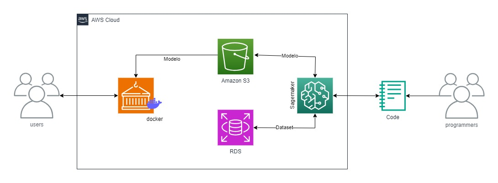
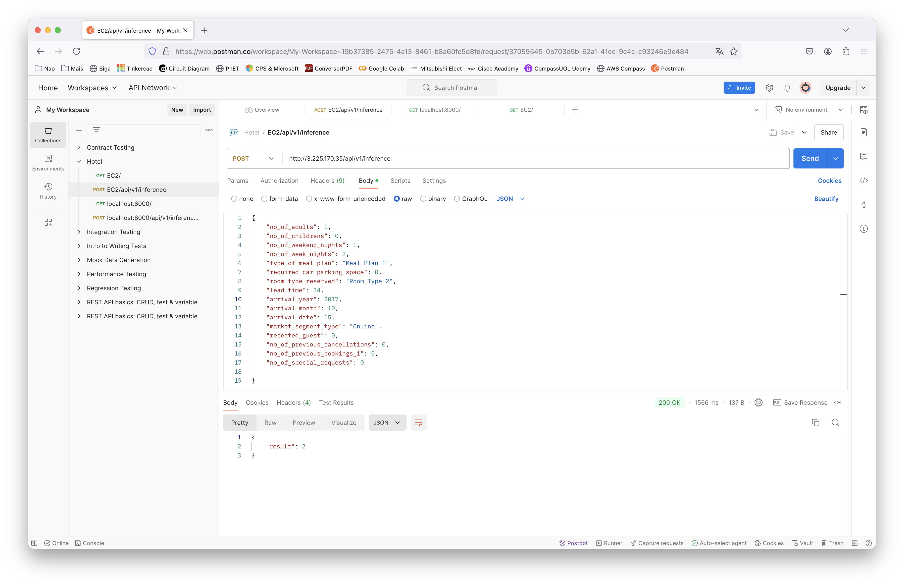

# **Avaliação de Custo de Hospedagem** 

## **👥 Desenvolvedores**

| [](https://github.com/Erick8874) <br>[*Erick Felix de Oliveira](https://github.com/Erick8874) | [](https://github.com/MarcelDBarbosa) <br>[Marcel Barbosa](https://github.com/MarcelDBarbosa) | [](https://github.com/niqueborges) <br>[Monique da Silva Borges*](https://github.com/niqueborges) |
|:---:|:---:|:---:|
---

## **📑 Índice**
- [📈 Status do Projeto](#-status-do-projeto)
- [✨ Funcionalidades](#-funcionalidades)
- [⚙️ Arquitetura e Fluxo de Trabalho](#-arquitetura-e-fluxo-de-trabalho)
- [🗃️ Banco de Dados](#-banco-de-dados)
- [⚙️ Variáveis de Ambiente](#-variáveis-de-ambiente)
- [📦 Como Rodar a Aplicação](#-como-rodar-a-aplicação)
- [🚀 Deploy](#-deploy)
- [💻 Tecnologias Utilizadas](#-tecnologias-utilizadas)
- [📂 Estrutura de Diretórios](#-estrutura-de-diretórios)
- [📐 Padrões Utilizados](#-padrões-utilizados)
- [📅 Metodologia de Desenvolvimento](#-metodologia-de-desenvolvimento)
- [😿 Principais Dificuldades](#-principais-dificuldades)
- [📝 Licença](#-licença)

---

## **📈 Status do Projeto**
🚀 **Status:** Finalizado

O projeto de Avaliação de Custo de Hospedagem está completo e o modelo de machine learning foi implantado em produção. A API está operacional e acessível conforme o planejado nas sprints 4 e 5 do programa de bolsas.

---

## **✨ Funcionalidades**
1. **Treinamento do Modelo**: 
   - Utilização do AWS SageMaker para treinar um modelo de machine learning que classifica reservas de hotel em diferentes faixas de preço.

2. **API de Inferência**:
   - Desenvolvida utilizando Flask/FastAPI, a API carrega o modelo treinado do S3 e realiza inferências em tempo real com os dados fornecidos.

3. **Deploy na AWS**:
   - A API foi implantada utilizando serviços da AWS, como EC2, Lambda e API Gateway, para garantir alta disponibilidade e escalabilidade.

4. **Persistência de Dados**:
   - O conjunto de dados é armazenado no AWS RDS e o modelo é armazenado no S3.

5. **Infraestrutura como Código**:
   - Dockerfile disponível para containerização e scripts para facilitar o deploy da aplicação.

---

## **⚙️ Arquitetura e Fluxo de Trabalho**

<div style="display: flex;">



1. **Pré-processamento e Treinamento do Modelo**:
   - Os dados são pré-processados para criar a coluna `label_avg_price_per_room`, que classifica as reservas.
 
   - Se o preço for <=85 é definida como categoria 1, se o preço for >85 e <=115 é definida como categoria 2, se o preço for >115 é definida como categoria 3.

   - As colunas que continham valores textuais foram convertidas para valores inteiros. A coluna `type_of_meal_plan` teve a seguinte codificação: "Not Selected" foi trocado por 0, "Meal Plan 1" por 1, "Meal Plan 2" por 2 e "Meal Plan 3" por 3. A coluna `room_type_reserved` teve os valores alterados de "Room_Type 1" para 1, "Room_Type 2" para 2, e assim para todos os tipos de quartos. A coluna `market_segment_type` foi transformada seguindo as relações "Offline" = 0, "Online" = 1, "Corporate" = 2, "Complementary" = 3 e "Aviation" = 4.

   - As colunas que continham valores textuais foram convertidas para valores inteiros. A coluna `type_of_meal_plan` teve a seguinte codificação: "Not Selected" foi trocado por 0, "Meal Plan 1" por 1, "Meal Plan 2" por 2 e "Meal Plan 3" por 3. Foi convertido para um banco de dados do tipo Mysql e foi armazenado no AWS RDS; O modelo é então treinado no AWS SageMaker e armazenado no S3.

2. **API de Inferência**:
   - A API carrega o modelo treinado do S3 e oferece um endpoint POST [3.225.170.35/api/v1/inference](http://3.225.170.35/api/v1/inference/) para inferências baseadas nos dados de reserva.
   - No corpo do POST as informações passadas devem seguir o seguinte exemplo:

    {

    "no_of_adults": 1,

    "no_of_childrens": 0,

    "no_of_weekend_nights": 1,

    "no_of_week_nights": 2,

    "type_of_meal_plan": "Meal Plan 1",

    "required_car_parking_space": 0,

    "room_type_reserved": "Room_Type 2",

    "lead_time": 34,

    "arrival_year": 2018,

    "arrival_month": 10,

    "arrival_date": 15,

    "market_segment_type": "Online",

    "repeated_guest": 0,

    "no_of_previous_cancellations": 0,

    "no_of_previous_bookings_1": 0,

    "no_of_special_requests": 0

 
}

  <div style="display: flex;">


     

3. **Deploy**:
   - A aplicação foi implantada em uma instância EC2 da AWS, com configuração de segurança apropriada para tráfego HTTP/HTTPS.

---

## **🗃️ Banco de Dados**
- **AWS RDS**: Usado para armazenar tanto o conjunto de dados original quanto o processado.
- Para rodar localmente no MySQLWorkbench é necessário configurar um banco de dados no AWS RDS e obter as credenciais de conexão.

---

## **⚙️ Variáveis de Ambiente**
Para configurar o ambiente de desenvolvimento, crie um arquivo `credentials` no `subdiretório` ~/.aws/ e adicione as seguintes variáveis:

| Variável                | Descrição                                       | Exemplo                                                      |
|-------------------------|-------------------------------------------------|--------------------------------------------------------------|
| `aws_access_key_id`     | Chave de acesso da AWS                          | EXAMPLE1234567890                                            |
| `aws_secret_access_key` | Chave secreta da AWS                            | exampleSecretKey1234567890                                   |
| `aws_session_token`     | Token da Sessão                                 | VzLWVhc3QtMSJHMEUCIQD3ySmuWiopvch0oF77RpXa/VWE               |                      

---

## **📦 Como Rodar a Aplicação**

### **Utilizando Docker:**
1. **Clone o repositório:**
   ```bash
   git clone -b grupo-1 https://github.com/Compass-pb-aws-2024-JUNHO/sprints-4-5-pb-aws-junho.git
   ```

2. **Crie a imagem Docker para a API:**
   ```bash
   docker build -t hotel-reservations-api .
   ```

3. **Execute o container Docker:**
   ```bash
   docker run -p 80:5000 hotel-reservations-api
   ```

4. **Ou baixando diretamente a imagem**
   ```bash
   docker pull marceldupret/hotel:latest
   ```

### **Sem Docker:**
1. **Clone o repositório:**
   ```bash
   git clone -b grupo-1 https://github.com/Compass-pb-aws-2024-JUNHO/sprints-4-5-pb-aws-junho.git
   ```

2. **Instale as dependências:**
   ```bash
   pip install -r api/requirements.txt
   ```

3. **Mudar o diretório:**
   ```bash
   cd /src/scripts/inference 
   ```
4. **Execute a aplicação:**
   ```bash
   uvicorn main:app --host 0.0.0.0 --port 80
   ```

   - Acesse a API em: `http://localhost/api/v1/inference`

---

## **🚀 Deploy**
### **AWS EC2**:
1. Crie uma instância EC2 na região us-east-1.
2. Conecte-se via SSH à instância e instale o Docker.
3. Faça o pull da imagem Docker e execute o container.
4. Criar o arquivo de credenciais com as informações descritas na sessão Variáveis de Ambiente.

---

## **💻 Tecnologias Utilizadas**
- **Python**
- **AWS S3**
- **AWS RDS**
- **AWS SageMaker**
- **AWS EC2**
- **FastAPI**
- **Docker**
- **Git**

---

## **📂 Estrutura de Diretórios**

```plaintext
src/
│
├──_pycache_/
│   ├── main.cpython-311.pyc
├── assets/                            # Recursos visuais e outros assets
│   ├── sprint4-5.jpg
│   └── tela.png
├── data/                              # Conjuntos de dados utilizados no projeto
├── processed/                         # Dados processados
│   │   └── Hotel Reservations Quantif.csv
│   ├── raw/                           # Dados brutos
│   │   └── Hotel Reservations.csv
├── scripts/                           # Scripts e pipelines de processamento
│   ├── data_processing/               # Scripts relacionados ao processamento de dados
│   │   └── converte_csv.py
    ├── inference/                     # Scripts para inferência e previsões
│   │   ├── main.py
│   │   └── previsoes.py
│   ├── training/                      # Scripts relacionados ao treinamento do modelo
│   │   └── XGBoostSage.ipynb   
├── .dockerignore
├── .gitignore
├── dockerfile                         # Definição do Docker
├── requirements.txt                   # Dependências do projeto
├── LICENSE                            # Licença do projeto
└── README.md                          # Documentação do projeto


```

---

## **📐 Padrões Utilizados**

- **Commits Semânticos**: Todos os commits seguem o padrão de commits semânticos para manter o histórico do Git organizado.
- **Estrutura de Pastas**: A estrutura do projeto é organizada por responsabilidade, separando por `processamento de dados`, `treinamento de modelo` e `inferência`.

---

## **📅 Metodologia de Desenvolvimento**

- **Scrum**: A metodologia Scrum foi aplicada utilizando o Trello para gerenciar as tarefas em sprints:

  - **Sprint 1**: Pré-processamento e treinamento do modelo.
  - **Sprint 2**: Desenvolvimento da API e Dockerização.
  - **Sprint 3**: Deploy, validação do sistema e escrita do Readme.

---

## **😿 Principais Dificuldades**
- **Implantação da RDS**: As dificuldades são vários detalhes de configuração de VPC, grupos de segurança e regras.
- **Configuração do SageMaker**: Leitura dos dados no RDS.
- **Leitura do modelo no S3**: As regras de segurança não permitem fazer o download do arquivo.
- **Acesso dos dados do S3 no EC2**: Configuração das credenciais.

---

## **📝 Licença**

Este projeto é licenciado sob a [Licença MIT](LICENSE).

---

<div align="center">
   
    
    
   
  
  
  
</div>

Este README foi preparado para garantir que todos os aspectos do projeto sejam claros e bem documentados, alinhando-se às melhores práticas recomendadas pelo programa de bolsas da Compass UOL e AWS.

--- 


